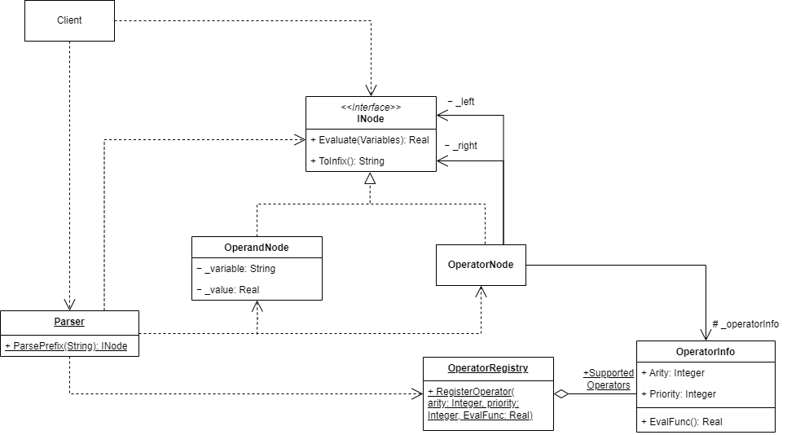

# Отчет: Применение паттерна "Компоновщик" для представления математических выражений

## Постановка задачи
В системе моделирования используется представление математического выражения (функции n переменных) в виде дерева вычисления.  
Листьями дерева являются переменные или константы, а промежуточные узлы представляют математические операции, включая операторы (`+`, `-`, `*`, `/`) и элементарные функции (`sqrt`, `exp`, `log`).  
**Требования к системе:**
- Хранение выражения в виде дерева.
- Вычисление значения выражения при заданных переменных.
- Вывод выражения в традиционной (инфиксной) нотации.
- Ввод выражения в польской (префиксной) нотации с автоматическим построением дерева.
## Решение без паттерна
Без использования паттерна выражение обрабатывалось внутри клиента последовательным разбором строки и вычислялось с помощью использования стеков и вложенных тернарных операторов.  
**Недостатки такого подхода:**
- **Трудоемкость поддержки и расширения** – отсутствие четкой архитектуры затрудняет добавление новых операторов, так как их внедрение требует внесения изменений в разные части кода вместо простого расширения системы.  
- **Отсутствие единой модели представления выражений** – не хранится каким то определенным образом, что исключает возможность его переиспользования.
## Решение с использованием паттерна "Компоновщик"
Применение паттерна **"Компоновщик"** позволяет представить выражение в виде иерархического дерева, где узлы представляют операции, а листья – константы и переменные. Помимо этого добавлены статические классы для парсинга и хранения информации о существующих операторах.
### Основные классы:
1. **`INode` (интерфейс узла дерева)**  
   - `Evaluate(Variables): Real` – вычисляет значение узла.
   - `ToInfix(): String` – возвращает строковое представление в инфиксной нотации.
2. **`OperandNode` (лист дерева)**
   - Представляет либо числовую константу, либо переменную.
   - Значение переменной берет из передаваемого словаря `Variables`.
3. **`OperatorNode` (узел-оператор)**
   - Представляет узел оператора в дереве решения.
   - Хранит ссылки на дочерние узлы и информацию об операторе.
4. **`OperatorInfo` (информация об операторе)**
   - Хранит приоритет, арность и делегат `EvalFunc` для вычисления значения.
5. **`OperatorRegistry` (реестр операторов)**
   - Содержит словарь зарегистрированных операторов хранящий пары {обозначение оператора : информация об операторе}
6. **`Parser` (разбор выражения)**
   - Анализирует выражение в префиксной нотации и строит дерево.
### Пример диаграммы классов:
  
*Рисунок 1 – Архитектура системы с применением паттерна "Компоновщик"*
## Пример работы с системой
**Входное выражение (префиксная нотация):**
	+ - + / * 2 20 2 * + 3 4 ^ 3 2 6 15
 
**Должно преобразоваться в инфиксную нотацию:**
	2 * 20 / 2 + (3 + 4) * 3 ^ 2 - 6 + 15
 
**Ожидаемый результат вычисления:** `92`
## Вывод
Использование паттерна **"Компоновщик"** позволило:
- **Обеспечить расширяемость** – добавление новых операторов осуществляется через `OperatorRegistry` и не требует модификации базовых классов, что соответствует принципу **Open/Closed (OCP)** из SOLID.
- **Соблюдать принцип единственной ответственности (SRP)** – каждый класс выполняет строго определенную функцию: `OperatorNode` хранит ссылки на операнды и структуру выражения, `OperatorInfo` содержит информацию об операторах и их реализацию, а `Parser` отвечает за разбор выражения и построение дерева.
- **Упростить восприятие и поддержку кода** – четкое разделение компонентов делает код более читаемым, тестируемым и удобным в сопровождении.
Таким образом, применение паттерна **"Компоновщик"** значительно упростило поддержку и расширение системы моделирования выражений.
