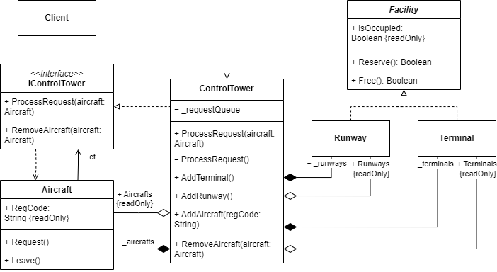

# Отчёт: Применение паттерна "Посредник" для реализации авиадиспетчерской вышки

## 1. Постановка задачи

Реализовать программное обеспечение авиадиспетчерской вышки, которая контролирует движение самолетов. Сами самолеты между собой напрямую не взаимодействуют. Должно быть минимум 3 взлетно-посадочных полосы и 5 терминалов, одновременно на каждой полосе и у каждого терминала может находиться только один самолет.
## 2. Решение без паттерна

Наивная реализация представляет собой массивы взлетно-посадочных полос и терминалов, а также список самолетов. Самолеты напрямую взаимодействуют с полосами и терминалами, проверяя их доступность и занимая их при необходимости.

В этом решении:

- Терминалы и полосы представлены обычными массивами.
    
- Самолеты самостоятельно ищут свободные полосы и терминалы.
    
- Управление состоянием объектов рассредоточено по разным частям кода.
    

### 2.1 Недостатки подхода

1. **Нарушение принципов SOLID:**
    
    - **S (Single Responsibility Principle)** – самолеты управляют процессом посадки/взлета, что не их задача.
        
    - **O (Open/Closed Principle)** – добавление новых типов полос/терминалов требует изменений в коде самолетов.
        
    - **D (Dependency Inversion Principle)** – самолеты напрямую зависят от полос и терминалов.
        
2. **Отсутствие централизованного управления:**
    
    - Трудно координировать посадку и взлет самолетов без конфликтов.
        
    - Нет единого места для логирования событий.
        
3. **Усложненная модификация:**
    
    - При добавлении новых правил движения нужно изменять код всех связанных объектов.
        

## 3. Использование паттерна "Посредник"

Для устранения недостатков вводится **авиадиспетчерская вышка (`ControlTower`)**, которая берет на себя управление полосами, терминалами и самолетами.

- Самолеты больше не взаимодействуют напрямую с полосами и терминалами, а отправляют запросы в диспетчерскую.
    
- ControlTower управляет очередью запросов, выдавая доступ к ресурсам по приоритету.
    
- Логирование событий ведется централизованно в одном месте.
    
- Добавление новых типов самолетов, полос или терминалов теперь не требует изменения кода существующих объектов.
    

## 4. Описание диаграммы классов

На **Рисунке 1** представлена архитектура системы с использованием паттерна "Посредник":

-  `Aircraft` – отправляет запросы на посадку или взлет в диспетчерскую.
    
- `ControlTower` – обрабатывает запросы, выделяет ресурсы, ведет логирование.
    
- `Facility` – базовый класс для `Runway` и `Terminal`, содержит логику резервирования и освобождения ресурсов.

  
```
Рисунок 1 – Архитектура приложения с применением паттерна "Посредник"
```

## 5. Выводы

Внедрение паттерна "Посредник"  улучшило архитектуру системы:

- Снижена связанность между объектами.
    
- Упрощено логирование и отслеживание состояния полос и терминалов.
    
- Реализовано централизованное управление ресурсами.
    
- Упрощено добавление новых типов самолетов и инфраструктуры без изменения существующего кода.
    

Таким образом, использование паттерна улучшило поддержку SOLID-принципов и обеспечило возможность гибкого расширения функционала системы.