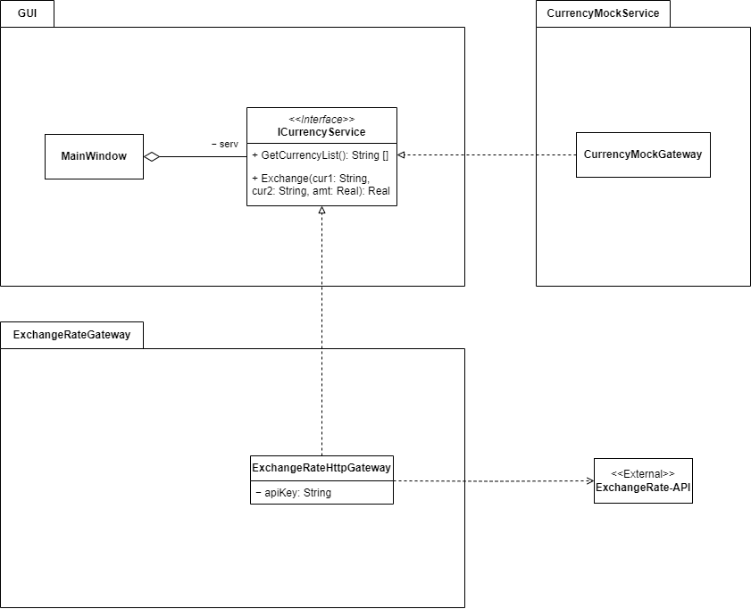

# Отчёт: Применение паттерна "Отделённый интерфейс" для реализации валютного конвертера
## 1. Постановка задачи
Реализовать систему конвертации валют с возможностью:
- Получения актуального списка доступных валют
- Конвертации суммы между валютами
- Поддержки различных API-провайдеров курсов валют
- Гибкой замены провайдера без изменения клиентского кода
## 2. Решение без паттерна
Наивная реализация предполагает прямое взаимодействие GUI с конкретным API-сервисом:
- GUI напрямую вызывает методы HTTP-клиента
- Код API-запросов перемешан с кодом интерфейса
- Смена провайдера требует переписывания кода форм
### 2.1 Недостатки подхода
1. **Нарушение принципов SOLID:**
   - **S (Single Responsibility)** - GUI отвечает и за отображение, и за работу с API
   - **D (Dependency Inversion)** - высокоуровневые модули зависят от низкоуровневых
1. **Проблемы сопровождения:**
   - Трудоемкость замены API-провайдера
   - Сложность тестирования
   - Отсутствие стандартизированного интерфейса работы с валютой
1. **Отсутствие гибкости:**
   - Невозможность быстрого переключения между провайдерами
   - Жесткая привязка к конкретной реализации
## 3. Использование паттерна "Отделённый интерфейс"
Для решения проблем вводится:
1. Интерфейс `ICurrencyService`, определяющий контракт работы с валютой
1. Класс `CurrencyMockGateway`, мокирующий интерфейс
1. Класс `ExchangeRateHttpGateway`, реализующий интерфейс для конкретного API
1. Инъекция зависимости через конструктор MainWindow
Преимущества:
- GUI взаимодействует только с интерфейсом
- Конкретная реализация может быть легко заменена
- Добавление новых провайдеров не требует изменения клиентского кода


```
Рисунок 1 – Архитектура приложения с применением паттерна "Посредник"
```
## 4. Описание ключевых компонентов
1. **`ICurrencyService` (интерфейс)**
   - `GetCurrencyList()` - получение списка валют
   - `Exchange()` - конвертация суммы между валютами
1. **`ExchangeRateHttpGateway` (реализация)**
   - Работа с ExchangeRate-API
   - Обработка HTTP-запросов
   - Парсинг JSON-ответов
1. **`CurrencyMockGateway` (сервис заглушка)**
   - Реализует интерфейс для тестирования приложения
1. **`MainWindow` (GUI)**
   - Отображение формы
   - Работа только через интерфейс ICurrencyService
   - Обработка событий пользователя
## 5. Выводы
Применение паттерна "Отделённый интерфейс" позволило:
1. **Снизить связанность** компонентов системы
2. **Упростить тестирование** (возможность мокирования интерфейса)
3. **Обеспечить гибкость** - легкую замену API-провайдера
4. **Соблюсти принципы SOLID**:
   - Single Responsibility - четкое разделение обязанностей
   - Dependency Inversion - зависимости на абстракциях
   - Open/Closed - система открыта для расширения
Решение демонстрирует преимущества разделения интерфейса и реализации, что особенно важно при работе с внешними API, которые могут изменяться или заменяться в процессе развития системы.